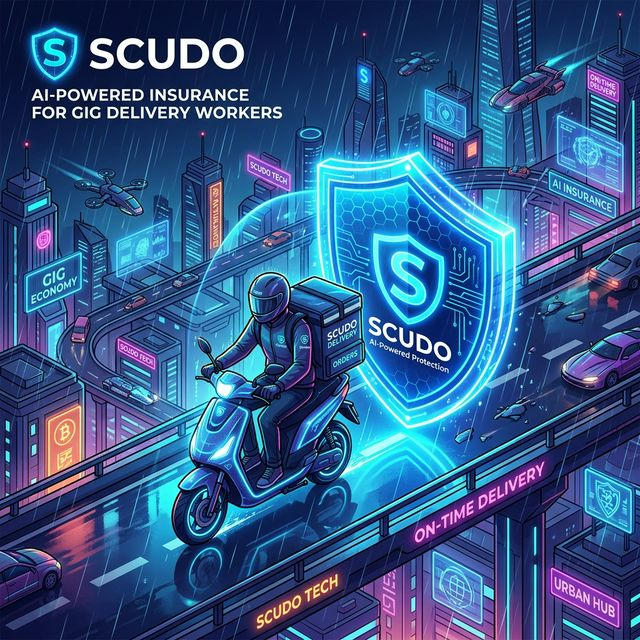
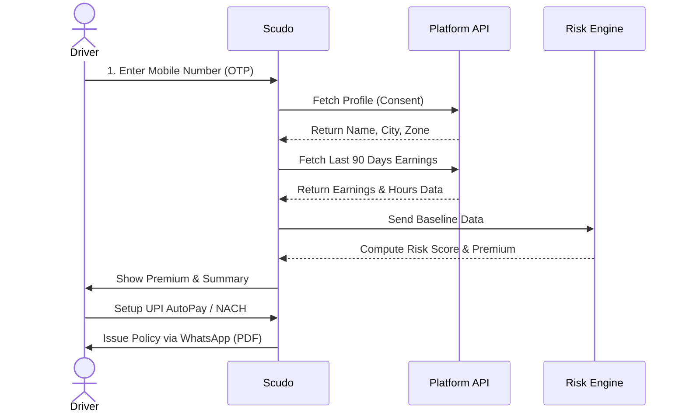
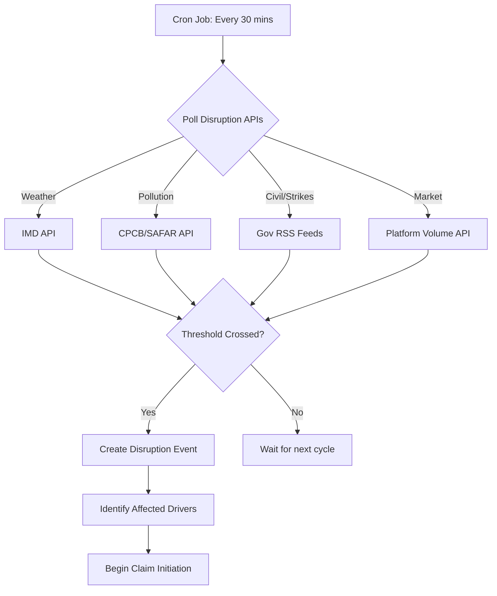
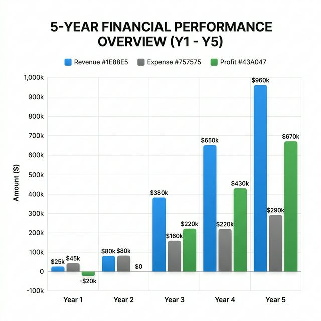

# Scudo — AI-Enabled Parametric Income Insurance for Gig Workers

Scudo is an AI-powered parametric income platform built for India's 12 million platform-based delivery workers. When an external disruption — cyclone, bandh, AQI emergency, platform outage — prevents a driver from earning, Scudo detects it automatically, verifies it against authoritative data sources, and pays out by 7 AM the next morning. No claim forms. No assessors. No paperwork.

---

## Table of Contents

1. [Problem Statement](#1-problem-statement)
2. [Solution Overview](#2-solution-overview)
3. [Coverage Scope — What Is and Isn't Insured](#3-coverage-scope--what-is-and-isnt-insured)
4. [Covered Disruption Categories](#4-covered-disruption-categories)
5. [Driver Onboarding Flow](#5-driver-onboarding-flow)
6. [AI-Powered Risk Assessment](#6-ai-powered-risk-assessment)
7. [Weekly Premium Model](#7-weekly-premium-model)
8. [Worker Activity Index (WAI)](#8-worker-activity-index-wai)
9. [Parametric Claim Automation](#9-parametric-claim-automation)
10. [Payout Formula and Processing](#10-payout-formula-and-processing)
11. [Intelligent Fraud Detection](#11-intelligent-fraud-detection)
12. [Adversarial Defence and Anti-Spoofing Strategy](#12-adversarial-defence-and-anti-spoofing-strategy)
13. [API and Integration Architecture](#13-api-and-integration-architecture)
14. [Analytics Dashboard](#14-analytics-dashboard)
15. [Revenue Model and Financial Projections](#15-revenue-model-and-financial-projections)
16. [Risk Tier Classification](#16-risk-tier-classification)
17. [The Mumbai End-to-End Example](#17-the-mumbai-end-to-end-example)
18. [System Limitations and Roadmap](#18-system-limitations-and-roadmap)
19. [Glossary](#19-glossary)

---

## 1. Problem Statement

India has over 12 million platform-based delivery partners working for Zomato, Swiggy, Zepto, Amazon, Dunzo, Shadowfax, and others. They are the operational backbone of the country's ₹1.5 lakh crore quick-commerce and food-delivery economy.

These workers operate in a structurally precarious position:

- They are classified as independent contractors, not employees — no employer-backed safety nets apply
- They earn ₹600–₹1,400 per day under normal conditions, paid weekly or bi-weekly by platforms
- Their income is **entirely dependent on their ability to be physically mobile and on-platform**

When an external disruption strikes — a cyclone in Chennai, a bandh in Mumbai, an AQI spike in Delhi — these workers lose 20–30% of their monthly income in a single event. They have no recourse. Traditional insurance products either don't cover income loss at all, require lengthy claim assessments, or exclude gig workers due to lack of formal employment documentation.

**The gap Scudo fills:** A fully automated, parametric income insurance product priced weekly, triggered externally, paid instantly — designed specifically for the earnings cycle and risk profile of India's delivery workforce.

---

## 2. Solution Overview

Scudo is a **parametric income insurance platform** with four distinguishing properties:

**1. Parametric triggers, not claims-based assessment**
Payouts are not initiated by the driver filing a claim. They are initiated automatically when a verified external disruption event is detected in the driver's city. The driver does not need to prove loss — the system proves it on their behalf using external data sources.

**2. Weekly pricing aligned to gig earning cycles**
Delivery partners receive platform payouts weekly or bi-weekly. Scudo's premium is structured on the same weekly cycle — debited automatically from the driver's linked UPI/bank account, matching the mental model of "this week's insurance cost comes from this week's earnings."

**3. AI-driven risk profiling, not uniform pricing**
Every driver has a unique risk profile based on their city, platform, earnings history, working hours, and seasonal disruption exposure. Scudo's risk engine computes a personalised weekly premium rather than applying a flat rate.

**4. Dual-gate fraud detection built into the payout mechanism**
The payout formula itself contains fraud resistance — drivers must demonstrate genuine work attempt on disruption days to receive full payouts. On top of this, a five-layer adversarial defence stack (Section 12) defends against GPS spoofing, device farms, and coordinated fraud rings at scale.

### What Scudo Does NOT Cover

| Excluded | Reason |
|---|---|
| Health / medical claims | Separate product category; outside scope |
| Life insurance / accidental death | Separate product category; outside scope |
| Vehicle repair / damage | Covers income loss only, not asset damage |
| Personal underperformance | Low-demand days, rating drops, cancelled orders from driver error are not covered |
| Driver-organised strikes | Disruptions caused by the driver's own collective action are excluded |

---

## 3. Coverage Scope — What Is and Isn't Insured

Scudo insures exactly one thing: **the income a driver loses because an external, verifiable disruption prevented them from working normally.**

The key test for any claim event is whether the disruption is:
- **External** — not caused by the driver, the platform's normal operations, or individual driver decisions
- **Verifiable** — confirmed by a government authority, official alert system, or platform-level data
- **Measurable** — produces a quantifiable income loss relative to the driver's established earnings baseline

If all three conditions are met, the claim is eligible. If any one fails, it is not.

---

## 4. Covered Disruption Categories

### 4.1 Environmental Disruptions

India's delivery drivers face the most severe environmental income risk of any gig worker segment. Outdoor mobility is their entire value proposition — when weather prevents movement, income drops to zero.

#### 4.1.1 Extreme Weather

**Trigger source:** India Meteorological Department (IMD) district-level alert, published by 06:00 AM IST on the disruption day.

| Alert level | Conditions | Income loss rate applied |
|---|---|---|
| Orange alert | Heavy to very heavy rain (64–204mm/day), strong winds, localised flooding | **60%** of expected daily earnings |
| Red alert | Extremely heavy rain (>204mm/day), cyclone conditions, large-scale flooding | **80%** of expected daily earnings |

**Retroactive reclassification policy:** IMD sometimes upgrades or downgrades alerts after issuance. Scudo locks the alert level at 06:00 AM on the day. Post-hoc changes do not alter payout calculations — this prevents alert-timing games.

**Coastal city exposure index (disruption days per year, 3-year historical average):**

| City | Weather disruption days/year |
|---|---|
| Mumbai | 12–18 |
| Chennai | 10–16 |
| Kolkata | 10–14 |
| Hyderabad | 6–10 |
| Delhi | 4–8 |
| Bengaluru | 4–7 |

#### 4.1.2 Severe Air Pollution (AQI Events)

Relevant primarily for Delhi, Lucknow, Kanpur, and other North Indian cities during October–January.

**Trigger source:** CPCB (Central Pollution Control Board) or SAFAR AQI data, district level.

| AQI level | Category | Income loss rate |
|---|---|---|
| 301–400 | Very Poor | **30%** — delivery platforms may restrict zones |
| 401–500 | Severe | **50%** — outdoor activity strongly discouraged; many drivers self-suspend |
| >500 | Severe+ / Emergency | **70%** — government may invoke GRAP Stage IV restrictions |

**City applicability:** AQI disruption applies only to cities where CPCB/SAFAR data is available and where the city's 3-year AQI history shows ≥3 Severe+ days per year. Currently applicable: Delhi NCR, Lucknow, Kanpur, Patna, Varanasi.

#### 4.1.3 Extreme Heat Events

**Trigger source:** IMD Heat Wave declaration for the driver's district.

| Condition | Definition | Income loss rate |
|---|---|---|
| Heat wave | Max temp ≥ 40°C in plains; ≥4.5°C above normal | **35%** |
| Severe heat wave | ≥ 6.5°C above normal OR max temp ≥ 47°C | **55%** |

Heat events reduce both driver willingness to work and customer ordering behaviour during peak heat hours (11am–4pm). Loss rates are lower than rain events because morning and evening hours remain workable.

---

### 4.2 Social / Civil Disruptions

**Trigger source:** Official declaration by State Home Department, Municipal Corporation, District Collector, or Police Commissioner. For transport-specific strikes, declaration by a recognised union body confirmed by local administration.

| Event type | Scope | Income loss rate |
|---|---|---|
| Partial bandh / zonal shutdown | Specific zones, markets, or transport modes shut; two-wheelers may be exempt | **70%** |
| Full city bandh | City-wide commercial shutdown; enforced by police presence | **85%** |
| Section 144 / curfew | Legal prohibition on movement; essential services only | **90%** |
| Transport strike (city-wide) | All motorised transport halted; petrol pumps may close | **75%** |

**Secondary confirmation trigger:** For civil events, Scudo additionally requires that platform-level order volume in the affected city drops ≥50% compared to the median of the same weekday over the prior 4 weeks. This cross-check prevents false positives from ambiguously scoped declarations.

**Explicitly excluded from civil disruptions:**
- Driver-organised strikes against a specific platform (e.g. Swiggy driver protests)
- Political rallies or processions causing traffic delays but not shutting commerce
- Communal tensions affecting specific neighbourhoods but not the whole city

---

### 4.3 Market / Platform Anomalies

**Trigger source:** Platform-internal data (or simulated equivalent).

| Event type | Definition | Income loss rate |
|---|---|---|
| Platform degraded | City-level order volume <40% of 30-day rolling daily average for ≥4 continuous hours | **40%** |
| Full platform outage | App/backend non-functional for ≥4 hours; verified via third-party monitoring + driver ping data | **60%** |
| Fuel price spike | Retail fuel increases ≥20% in a 7-day window per IOC/HPCL/BPCL notification | **35%** |

Market anomaly loss rates are structurally lower than weather/civil rates because partial recovery is possible — drivers can switch platforms, rest during outage hours, or recover in evening shifts.

---

## 5. Driver Onboarding Flow

Scudo onboarding is optimised for low-literacy, low-smartphone-proficiency users. It takes under 8 minutes and requires no document upload beyond what the driver already submitted to their platform.



### Step 1 — Identity and Platform Linking (2 min)

The driver enters their mobile number (OTP verified). Scudo fetches their platform profile from the linked delivery app API using the driver's consent. This provides: driver name, city, registered zone, platform enrollment date (tenure signal), and vehicle type.

No separate document upload is required at this step. Aadhaar/PAN are only collected if a payout exceeds ₹50,000 in a financial year (TDS threshold).

### Step 2 — Earnings Baseline Establishment (automated, ~1 min)

Scudo pulls the driver's last 90 days of earnings data from the platform API (with consent) and computes: `avg_daily_earn`, `normal_daily_hours`, `weekly_orders`, and `weekly_gmv`. For drivers with <30 days on platform, city-segment defaults are used, flagged as "estimated — pending calibration."

### Step 3 — Risk Profile Computation (automated, <1 sec)

The system automatically computes: Annual Risk Score, Risk Tier, Weekly Base Premium, and WAI-adjusted Weekly Premium. The driver sees a plain-language summary with a "How is this calculated?" option — no jargon by default.

### Step 4 — UPI / Bank Mandate Setup (2 min)

Weekly premium deduction via UPI AutoPay (preferred), NACH mandate, or deduction from platform weekly payout (Swiggy pilot). Premium debited every Monday at 09:00 AM. A 48-hour grace window applies if deduction fails before coverage lapses.

### Step 5 — Confirmation and Policy Issuance (instant)

Driver receives a WhatsApp confirmation with policy number and coverage summary in their preferred language (Hindi, Tamil, Telugu, Kannada, or English), plus a simplified 2-page PDF policy document. Coverage starts the next calendar day to prevent same-day event gaming.

---

## 6. AI-Powered Risk Assessment

Scudo's risk engine has three layers: a baseline actuarial model, a driver-specific ML scoring layer, and a real-time adjustment layer.

### Layer 1 — Actuarial Baseline (City × Disruption Type)

A city-level disruption frequency model derived from 5 years of IMD alert data, municipal/state government civil event logs, and platform incident reports. This produces a **disruption probability matrix** per city per month — capturing seasonality (monsoon peaks, winter AQI peaks, election-related curfew spikes).

### Layer 2 — Driver-Specific Risk Scoring

```
Annual_Risk = Σ [disruption_days(category) × avg_daily_earn × loss_rate(category)]

Annual_Risk =
    (weather_days × avg_daily_earn × weather_weighted_loss_rate)
  + (aqi_days     × avg_daily_earn × aqi_weighted_loss_rate)
  + (heat_days    × avg_daily_earn × heat_weighted_loss_rate)
  + (civil_days   × avg_daily_earn × civil_weighted_loss_rate)
  + (market_days  × avg_daily_earn × market_weighted_loss_rate)
```

**Weighted loss rates** are computed from the city's historical severity distribution. If Mumbai had 12 weather disruption days — 8 orange and 4 red — the weighted weather loss rate = (8×60% + 4×80%) / 12 = 66.7%.

**`avg_daily_earn` is driver-specific**, updated quarterly from platform data. This is the most important personalisation input — a ₹1,400/day driver has nearly double the income at risk of a ₹750/day driver in the same city.

### Layer 3 — Real-Time Risk Adjustment

Premium rates are recalibrated quarterly to prevent volatility that disrupts driver budget planning. Off-cycle re-assessment is triggered if: earnings change ≥25% in 30 days, the driver switches city, the driver changes platform, or the driver has 3+ payouts in 60 days (fraud review trigger).

### ML Model for New Driver Risk Scoring

For drivers with <30 days of earnings history, a gradient-boosted classifier trained on city, zone, platform, vehicle type, enrollment month, and cohort benchmarks produces an estimated `avg_daily_earn` and risk tier, recalibrated at day 30 with actual data.

---

## 7. Weekly Premium Model

### Why Weekly, Not Monthly?

India's delivery drivers are paid weekly or bi-weekly. Monthly insurance premiums create a cash-flow mismatch — drivers must maintain ₹200–₹400 in reserve for a deduction that doesn't match their earning cycle, producing lapse rates of 40–60% in traditional monthly-premium gig products. A weekly premium of ₹30–₹80 maps directly to "this week's insurance comes from this week's earnings." Lapse rates in weekly-debit UPI AutoPay products run 3–4× lower.

### Premium Rate Bands

| Annual Risk Score | Premium Rate | Rationale |
|---|---|---|
| ≤ ₹6,000 | **14%** | Low absolute risk; higher rate needed for actuarial viability |
| ₹6,001 – ₹15,000 | **12%** | Mid-range; most metro drivers fall here |
| ₹15,001 – ₹30,000 | **10%** | High absolute risk; lower rate prevents unaffordability |
| > ₹30,000 | **8%** | Very high risk; capped to maintain driver adoption |

The decreasing rate structure ensures the product remains accessible for the highest-risk drivers, who are disproportionately those with the highest earnings exposure.

### Formula

```
Annual_Premium       = Annual_Risk × premium_rate
Weekly_Premium_Base  = Annual_Premium ÷ 52
Final_Weekly_Premium = Weekly_Premium_Base × WAI   [WAI clamped: 0.5–1.2]
```

### Reference Premiums (Mumbai, ₹1,000 avg daily earnings)

| Annual Risk | Rate | Annual Premium | Weekly Base |
|---|---|---|---|
| ₹8,000 | 12% | ₹960 | ₹18.46 |
| ₹14,000 | 12% | ₹1,680 | ₹32.31 |
| ₹22,000 | 10% | ₹2,200 | ₹42.31 |
| ₹35,000 | 8% | ₹2,800 | ₹53.85 |

---

## 8. Worker Activity Index (WAI)

Two drivers in the same city with the same Annual Risk Score may work very differently. The part-time driver has half the income exposure on any disruption day. The WAI is a personalised activity multiplier that scales both the weekly premium and the expected payout to reflect actual working intensity.

### Formula

```
WAI = 0.4 × hours_ratio + 0.3 × orders_ratio + 0.3 × value_ratio

hours_ratio  = driver_weekly_hours  ÷ city_median_weekly_hours
orders_ratio = driver_weekly_orders ÷ city_median_weekly_orders
value_ratio  = driver_weekly_gmv    ÷ city_median_weekly_gmv

WAI clamped to [0.5, 1.2]
```

**Floor 0.5:** Activity too low for meaningful income exposure; coverage flagged for review.
**Ceiling 1.2:** Prevents penalising the highest-earning drivers; premium cannot exceed 120% of base.

### Weight Rationale

| Component | Weight | Why |
|---|---|---|
| Hours | 40% | Time on app is the primary proxy for disruption exposure |
| Orders | 30% | Throughput independent of time; measures income velocity at stake |
| GMV | 30% | Income value per disruption hour; high-value drivers lose more per disruption |

### WAI Interpretation

| WAI | Profile | Premium vs base |
|---|---|---|
| 0.5–0.7 | Part-time, below-median activity | 50–70% |
| 0.7–0.9 | Moderate; below city median | 70–90% |
| 0.9–1.1 | Typical full-time driver | 90–110% |
| 1.1–1.2 | High-activity, peak-hour focus | 110–120% |

---

## 9. Parametric Claim Automation

Scudo's core promise is zero-friction payouts. No driver should ever file a claim, upload documents, or wait for an assessor.

### Trigger Monitoring Pipeline



### Claim Initiation Flow

1. **Event record created** — event_type, severity, city, affected_districts, start_time, trigger_source
2. **Affected drivers identified** — all Active drivers enrolled in the affected city/district
3. **Baseline pulled** — each driver's `expected_daily_earn` (90-day trailing average)
4. **Day-end data collection at 23:30 IST** — actual earnings, GPS-verified hours, completed orders, from platform API
5. **Payout computed** per driver (Section 10)
6. **Anti-cheat gates evaluated** (Section 11) and adversarial signals checked (Section 12)
7. **Payout initiated** via UPI/NEFT — credited by 07:00 AM the following morning

**Automatic claim window:** The disruption must span ≥3 hours of the driver's declared working window. A 45-minute rain burst does not trigger a payout.

---

## 10. Payout Formula and Processing

### Core Payout Formula

```
Payout = 0.70 × (expected_daily_earn − actual_daily_earn) × compliance_factor
```

**Why 70% and not 100%?** The 30% co-participation preserves the driver's incentive to attempt work. A driver who earns ₹400 on a bad day (vs expected ₹1,000) receives 0.70 × ₹600 × compliance_factor = ₹420 × compliance_factor — making their total ₹820. They are always better off trying to work than staying home.

### Gate 1 — Compliance Factor (Hours, Smooth Scale)

```
floor_hours = severity_factor × normal_daily_hours × 0.4

severity_factor:
    partial disruption (orange / partial bandh / degraded) = 0.6
    full disruption    (red    / full curfew / full outage) = 1.0

compliance_factor = min(1.0, actual_hours_worked ÷ floor_hours)
```

`actual_hours_worked` = GPS-verified active movement on platform. Idle sessions (app open, no movement for >20 minutes, no order accepted) are excluded.

| Hours worked vs floor | compliance_factor | Payout received |
|---|---|---|
| 0% | 0.0 | ₹0 |
| 25% | 0.25 | 25% of calculated payout |
| 50% | 0.50 | 50% of calculated payout |
| 75% | 0.75 | 75% of calculated payout |
| 100%+ | 1.0 | Full calculated payout |

A smooth scale rather than a binary cliff eliminates threshold-gaming incentives and is fairer to drivers making genuine effort under extreme conditions.

### Gate 2 — Minimum Order Floor (Binary)

```
min_orders_required:
    Partial disruption → 2 completed deliveries
    Full disruption    → 1 completed delivery

if actual_orders < min_orders_required:
    Final_Payout = ₹0
else:
    Final_Payout = Payout (formula above)
```

Gate 2 prevents the "GPS hours without working" exploit — a driver who parks with the app open accumulates location hours without completing any orders.

### Payout Processing

**Channel:** UPI (primary), NEFT (fallback), platform wallet credit where integration exists.
**Timeline:** Initiated by 07:00 AM the morning after the disruption day; credited within 2–4 hours (UPI).
**Notification:** WhatsApp message in driver's preferred language confirming payout amount.
**Minimum payout threshold:** ₹50. Sub-threshold amounts accumulate and disburse at next event or month-end.

---

## 11. Intelligent Fraud Detection

Fraud in parametric insurance shifts away from false claim filing (the trigger is external and beyond the driver's control) and toward **manipulating compliance evidence** — appearing to have worked on a disruption day without actually working. Scudo's first line of defence operates at the claim formula level.

### Claim-Level Anomaly Detection

**GPS pattern flags:**
- Stationary >45 minutes with app marked "active" — suggests parked with app running
- Location clustering within 500m radius for >2 hours — no actual delivery movement
- GPS matches registered home address for >60% of claimed active hours

**App session flags:**
- Session opened at exactly the start of the claim window and closed at exactly the end — statistically anomalous precision
- Long session with zero order accepts, no map navigation events, no customer chat

**Order metadata flags:**
- Deliveries completed in physically impossible times (4km in 3 minutes)
- All orders clustered within 0.5km of driver's home address
- Orders cancelled at pickup counted as "attempted" — driver never delivered

### Cross-Driver Pattern Detection

- A cluster of drivers from the same residential area all achieving compliance_factor = 1.0 with exactly the minimum order count on the same disruption day is statistically implausible
- Drivers with personal claim rates 3 standard deviations above city median for the same disruption type are flagged for secondary review
- Cross-account deduplication on mobile number, UPI VPA, and Aadhaar hash prevents duplicate payouts

### Suspension and Recovery

**Suspension trigger:** Coverage blocked when anti-cheat gates fail on 2+ events within 60 days with at least one confirmed anomaly signal.
**Recovery:** WhatsApp-based appeal review within 48 hours for legitimate edge cases.
**Permanent exclusion:** Confirmed GPS/order data fraud; flagged to partner platform's trust and safety team.

The full five-layer adversarial defence stack — including GPS spoofing detection, device fingerprinting, motion coherence analysis, and fraud ring graph detection — is described in the next section.

---

## 12. Adversarial Defence and Anti-Spoofing Strategy

Scudo's platform assumes that **GPS can be faked, devices can be shared, and fraud rings can coordinate at scale**, so the system is designed for adversaries, not ideal users.

### Threat Model

Three main attacker types are defended against:

**Opportunistic spoofers** — single drivers using fake GPS / mock-location apps, VPNs, or emulators to appear present in a disruption zone they are not actually experiencing, or to inflate their compliance hours without moving.

**Policy gamers** — real workers who selectively go offline on risky days and then try to claim income protection using loopholes in the parametric triggers. These workers have genuine accounts and clean device fingerprints; their gaming is behavioural, not technical.

**Coordinated fraud rings / device farms** — groups controlling dozens or hundreds of accounts with shared devices, IP addresses, and locations, attempting mass fake claims during large-scale events like a city-wide "Market Crash" trigger. These are the highest-value attackers and the hardest to catch with single-account signals.

The objective is to **make fraud economically unviable** while keeping friction minimal for honest workers.

---

### Layer 1 — Device and Environment Integrity

Scudo never trusts a single GPS coordinate. Instead, it continuously scores a "location trust" value using multiple low-level device checks.

**Mock-location and spoofing-tool detection:**
The system detects OS-level "Allow mock locations" / developer-mode flags and checks for the presence of known fake-GPS apps or emulators on the device. If detected, the location-trust score drops sharply and the account is moved to heightened scrutiny. Repeated use of mock-location tools can permanently block eligibility for automated payouts.

**Device fingerprinting and uniqueness:**
A device fingerprint is built from hardware, OS, network, and app attributes. The same device cannot safely operate multiple "different" driver accounts. If multiple accounts share a fingerprint — or if one account constantly rotates fingerprints — that account and its cluster are flagged for collusion review.

**Network and IP sanity checks:**
IP geolocation is compared against claimed GPS coordinates. Impossible combinations (GPS shows Chennai, IP exits via a distant data-centre) reduce the session's trust score. Repeated use of high-risk VPN or data-centre IP ranges for "field" activity raises the fraud-risk score for that session.

*Impact:* A 500-phone GPS farm or emulator cluster will register as "same or highly similar devices in one physical location showing inconsistent network and GPS behaviour" long before it can drain the claims pool.

---

### Layer 2 — Route, Motion, and Behaviour Consistency

Even with clean-looking GPS, Scudo examines *how the worker moves and works* across the session.

**Route realism and speed constraints:**
Trajectories are map-matched to actual roads and typical travel speeds. Teleportation, impossible speeds, or bouncing between distant zones in short intervals are classified as spoofing signals. Delivery paths must be consistent with the pickup and drop locations received from the partner platform; GPS that "floats" without corresponding platform events is discounted.

**Order-to-movement coherence:**
For every claimed working hour, the system expects a coherent pattern: online status, pings from the platform API, and short-range movement around restaurants and residential drop zones. Long, static "working" periods at a single coordinate while orders are supposedly flowing flag the session as suspicious.

**Baseline vs event-day behaviour:**
Each worker's normal pattern is learned by day-of-week and time-of-day — zones visited, typical route density, idle-to-moving ratio. On disruption days, that day's behaviour is compared to this baseline. Genuine workers may have fewer trips but show similar presence patterns; spoofers often show abnormal or copy-pasted motion that diverges from both the road network and their own history.

*Result:* A faker using joystick-style GPS or static spoofed coordinates will diverge from both the road network and their own historical pattern, even if raw GPS coordinates look individually valid.

---

### Layer 3 — Region-Aware Parametric Logic

Scudo's parametric triggers combine **region-level disruption data** with **individual behaviour evidence** so that a driver must actually be present and available in the affected zone to benefit.

**Region-based risk model:**
For each zone, Scudo pre-computes annual "income at risk" from IMD Orange/Red alerts, flood/cyclone data, and historical order drops — this determines the base weekly premium and expected loss per disruption day in that zone. Claims are only auto-triggered when external data confirms a disruption window (e.g. IMD Red alert + sharp zone-wide order collapse).

**Presence and effort requirements (the lower-limit rule):**
For each worker, normal hours and earnings in that region for comparable days are established. To be eligible for payout in a disrupted period, the driver must work at least a configurable share (50–70% in standard tiers) of their typical hours in that zone. Payout is then scaled by the compliance factor `C_w = min(1, H_actual / H_min)`. A driver who does not log in at all receives `C_w = 0` and no payout.

**Income-gap payout with caps:**
Only a fraction of the difference between expected and actual earnings during the confirmed disruption window is paid, up to a weekly cap linked to the driver's historical income and coverage level. This makes over-claiming unattractive and bounds maximum loss even if a fraud ring passes some checks.

---

### Layer 4 — Collusion and Fraud-Ring Detection

Fraud rings reveal themselves through **shared signals across many accounts**, not a single suspicious session. Scudo continuously builds a **fraud graph** over:

**Devices and fingerprints:** The same device running multiple driver accounts; devices repeatedly creating new accounts after blocks.

**Location clusters:** Many accounts appearing to operate from the same room or small radius while claiming different parts of the city — the device-farm proximity signature.

**Financial endpoints:** Repeated payouts to the same bank account, UPI VPA, or wallet; accounts linked by name, KYC documents, or Aadhaar hash.

**Temporal patterns:** Groups of drivers that always go online/offline in tight synchrony, claim the same disruptions, or request payouts within the same one-minute window.

Graph-level risk scores then:
- Escalate entire clusters for human review or delayed payouts when the cluster score crosses a threshold
- Down-rank the influence of their data in pricing and risk models, preventing fraud rings from poisoning parametric thresholds through volume

---

### Layer 5 — Protecting Honest Workers

The fraud system is designed to avoid punishing genuine, stranded workers.

**Multi-signal evidence:** The system requires evidence from device, network, motion, platform data, and region alerts before denying coverage. No single red flag triggers an automatic denial.

**Soft interventions first:** Most interventions begin as soft actions — reduced automation, manual review, or temporary payout caps — rather than immediate bans. Escalation to suspension or exclusion requires sustained, cross-signal evidence.

**Explainable timelines:** Every claim maintains an audit trail — what disruption was detected, where the worker was, and which signals were anomalous — so decisions can be explained and appealed.

**History works in the driver's favour:** Accounts with months of clean behaviour receive more benefit of the doubt and faster payouts than new or previously flagged accounts. The system rewards sustained honest participation.

---

## 13. API and Integration Architecture

Scudo is an integration layer on top of existing data sources. No data is self-reported by drivers — all signals come from external, authoritative sources.

### External Data Integrations

| Integration | Source | Data Used | Refresh Rate |
|---|---|---|---|
| Weather alerts | IMD API (data.gov.in) | District-level alert type and severity | Every 30 min |
| AQI data | CPCB Sameer API / SAFAR | City/district AQI index | Hourly |
| Heat wave alerts | IMD | District heat wave declarations | Every 30 min |
| Civil event alerts | State government RSS feeds / municipal notification APIs | Bandh/curfew declarations | Every 15 min |
| Fuel prices | IOC/HPCL/BPCL price notification APIs | City-level retail fuel prices | Daily |
| Driver earnings | Platform partner API | Daily earnings, orders, hours, GPS traces | End-of-day batch |
| Platform uptime | StatusPage API + internal ping monitoring | Uptime percentage, outage duration | Every 5 min |
| Device integrity | On-device SDK signals | Mock-location flags, developer-mode, fingerprint | Per session |
| Payment disbursement | Razorpay/PayU sandbox → production NPCI UPI | Payout initiation and confirmation | Real-time |

### Scudo Internal API Endpoints

| Endpoint | Method | Function |
|---|---|---|
| `/api/drivers/onboard` | POST | Create driver profile, compute initial risk score |
| `/api/drivers/{id}/profile` | GET | Return driver risk profile, WAI, current premium |
| `/api/disruptions/active` | GET | Return all active disruption events by city |
| `/api/claims/initiate` | POST | Manually trigger claim evaluation (admin use) |
| `/api/claims/{id}/status` | GET | Return claim status and payout details |
| `/api/premium/calculate` | POST | Interactive premium calculator endpoint |
| `/api/analytics/overview` | GET | Fleet-level KPI data for admin dashboard |
| `/api/fraud/flags` | GET | Anomaly flags pending review |
| `/api/fraud/graph` | GET | Fraud-ring cluster graph for a given driver or device |

---

## 14. Analytics Dashboard

The Scudo admin dashboard provides full operational visibility across five views.

### View 1: Fleet Overview

Top-line KPI cards: total enrolled drivers (Active/Pending/Suspended), weekly premium collected, payouts disbursed this month, fleet average WAI, fraud flag rate, and total annual risk exposure.

Charts: city-wise premium bar chart, risk tier donut (Low/Medium/High/Very High), weekly premium vs payout trend (12 weeks), disruption event calendar heatmap (6 months).

### View 2: Driver Registry

Searchable, sortable, filterable table with columns: Driver ID · Name · City · Platform · Risk Tier · WAI · Weekly Premium · Status · Claims (count).

**Driver Detail Panel** (click any row): full profile, premium breakdown (Annual Risk → rate band → base → WAI → final), compliance history, claim history, and fraud flag timeline.

### View 3: Disruption Event Log

Chronological event cards showing: date, city, category, severity, trigger source, drivers affected, total payout disbursed, and payout efficiency breakdown (% full / % partial / % zero). Per-event driver compliance tables are expandable.

### View 4: Premium Calculator (Interactive)

All inputs are sliders/dropdowns updating outputs live: Annual Risk, premium rate band, annual/weekly base/scaled premium, estimated maximum annual payout, and coverage ratio.

### View 5: Anti-Cheat Monitor

Per-driver compliance table for the most recent event, colour-coded by outcome (green / amber / red). Summary cards: drivers affected, both-gates passed, partial compliance, Gate 2 failures, and adversarial flags pending review.

---

## 15. Revenue Model and Financial Projections

Scudo's revenue model is built on weekly income-protection premiums, tuned by region risk and individual activity, sold B2B2C through gig platforms.

### Revenue Drivers

| Driver | Description |
|---|---|
| Active insured workers and take-rate per platform | The primary volume lever; more enrolled drivers × more platforms = more premium revenue |
| Average weekly premium per worker | Determined by region risk, coverage tier, and WAI; higher-risk cities generate higher average premiums |
| Loss ratio (claims ÷ premiums) | Target corridor of 40–55% at maturity; the primary actuarial health metric |
| Expense ratio (tech, ops, acquisition, data, reinsurance) | Target 20–25% at scale; falls as fixed costs are spread over more insured workers |

### Phase 1 — Learn (Year 0–1): Controlled Pilots

Small pilots of 200–500 riders across 1–2 cities. Premiums are flat and platform-subsidised during this phase. Scudo intentionally tolerates a high loss ratio to over-deliver on payouts and accumulate real disruption frequency, fraud pattern, and behavioural data. The company is deliberately loss-making in Phase 1 — the objective is data quality and product–market fit, not margin.

### Phase 2 — Earn (Year 1–2): City-Level Rollouts

Rollouts to thousands of riders. Premiums become personalised by region risk and WAI; AI fraud controls reduce the false-payout rate. Mature city cohorts reach positive underwriting margin (premiums > claims) even as the overall company remains pre-profit due to product development and city expansion spend.

### Phase 3 — Scale (Year 3+): Multi-City Profitability

Coverage across 15,000–20,000+ insured workers on several platforms. The loss ratio stabilises in the 40–55% corridor; the expense ratio falls toward 20–25% as technology and operations costs scale. Additional B2B revenue streams emerge from risk analytics dashboards and white-label insurance infrastructure sold to platforms. Underwriting margins at this point are sufficient to cover fixed costs, and the company reaches net profitability approximately in Year 3 — consistent with other parametric and usage-based insurance products that have reached scale.

### Revenue vs Expense vs Profit — Year Wise (₹ Crore)



The chart illustrates the three-phase trajectory: near-zero revenue and a small operating loss in Year 1 (2026) during the pilot; accelerating premium revenue and improving loss ratios through Years 2–3 (2027–2028) as personalisation and fraud controls mature; and a step-change in both revenue and net profit in Years 4–5 (2029–2030) as multi-platform scale drives the expense ratio down and premium volume up. Net profit turns positive and grows steeply from 2029 onward, reaching approximately ₹110 Crore by 2030 as premium revenue (~₹365 Crore) comfortably exceeds total expenses (~₹255 Crore).

---

## 16. Risk Tier Classification

| Tier | Annual Risk | Premium Rate | Typical driver profile |
|---|---|---|---|
| Low | < ₹6,000 | 14% | Inland city, part-time, lower daily earnings, few disruption days |
| Medium | ₹6,001 – ₹15,000 | 12% | Full-time metro driver; typical Mumbai/Chennai active driver |
| High | ₹15,001 – ₹30,000 | 10% | High-earning full-timer in coastal city; multiple disruption types overlap |
| Very High | > ₹30,000 | 8% | Top-earner in cyclone/flood-prone district; all disruption categories contribute |

The tier determines the **premium rate only** — it does not determine payout eligibility or amount. Payout is always based on actual income loss on the disruption day, regardless of tier.

---

## 17. The Mumbai End-to-End Example

This is the canonical reference case used throughout the system for calibration and testing.

**Driver profile:** Mumbai · Swiggy · ₹1,000 avg daily earnings · 8 hrs/day · 48 weekly hrs · 35 weekly orders · ₹6,200 weekly GMV

**Annual disruption exposure:**
- Weather: 12 days — 8 orange (60%), 4 red (80%) → weighted rate = 66.7%
- Civil: 4 days — 3 partial (70%), 1 full curfew (90%) → weighted rate = 75%
- Market: 6 days — 4 degraded (40%), 2 outage (60%) → weighted rate = 46.7%

**Annual Risk:**
```
Weather = 12 × ₹1,000 × 0.667 = ₹8,004
Civil   = 4  × ₹1,000 × 0.750 = ₹3,000
Market  = 6  × ₹1,000 × 0.467 = ₹2,802
                                ────────
Annual_Risk                     = ₹13,806
```

**Premium:**
```
premium_rate   = 12%  (₹6,001–₹15,000 band)
Annual_Premium = ₹13,806 × 0.12 = ₹1,657
Weekly_Base    = ₹1,657 ÷ 52    = ₹31.87/week
```

**WAI (city medians: 44 hrs / 30 orders / ₹5,500 GMV):**
```
hours_ratio  = 48 ÷ 44   = 1.091
orders_ratio = 35 ÷ 30   = 1.167
value_ratio  = 6200 ÷ 5500 = 1.127

WAI = (0.4 × 1.091) + (0.3 × 1.167) + (0.3 × 1.127) = 1.124

Scaled_Weekly_Premium = ₹31.87 × 1.124 = ₹35.82/week
```

**Payout on a Red Alert day** (actual earnings ₹180, hours worked 2.6, orders 3):
```
floor_hours       = 1.0 × 8 × 0.4 = 3.2 hrs
compliance_factor = min(1, 2.6 ÷ 3.2) = 0.8125
Gate 2: 3 orders ≥ 1 required → passes

Payout = 0.70 × (₹1,000 − ₹180) × 0.8125 = ₹466.15
```

| | Without Scudo | With Scudo |
|---|---|---|
| Income on disruption day | ₹180 | ₹646.15 |
| vs normal day (₹1,000) | −82% | −35% |

---

## 18. System Limitations and Roadmap

### Current Limitations

**City-level disruption baselines are historical averages.** An unusually severe monsoon year will underestimate risk for that cohort. Mitigation: annual recalibration + in-season Bayesian updating.

**WAI uses city-level medians, not platform-segment medians.** A Dunzo driver benchmarked against a Swiggy-dominated city median may have a distorted WAI. Mitigation: platform × city segment medians once data volume supports it.

**Loss rates are uniform per severity level across all cities.** A Red alert in coastal Mumbai is operationally more severe than a Red alert in semi-arid Pune. Mitigation: district-level loss rate calibration after 12+ months of claims data.

**Platform API integration is simulated in the current demo.** Real-time earnings and GPS data requires platform API partnerships. Swiggy integration is in pilot; others are on roadmap.

**Device integrity SDK requires platform cooperation.** The Layer 1 adversarial signals depend on an on-device SDK embedded in the partner platform's driver app. Until platform SDK integration is live, Layer 1 operates in a reduced-signal mode using network and session signals only.

### Product Roadmap

| Phase | Timeline | Key milestones |
|---|---|---|
| 0 — Demo | Current | Mock data, full formula engine, admin dashboard |
| 1 — Pilot | 0–6 months | Swiggy Mumbai integration, 500 live drivers, UPI AutoPay, Layer 1–2 fraud signals live |
| 2 — Expansion | 6–18 months | Zomato + Zepto integration, 5 cities, AQI trigger live, fraud graph active |
| 3 — Scale | 18–36 months | Amazon/Shadowfax, dynamic loss rates, full five-layer adversarial stack |
| 4 — Ecosystem | 36+ months | Fleet/aggregator policies, B2B risk analytics dashboards, white-label insurance infrastructure |

---

## 19. Glossary

| Term | Definition |
|---|---|
| **Annual Risk** | Expected annual income loss due to covered disruptions; the base for premium calculations |
| **WAI** | Worker Activity Index — a 0.5–1.2 multiplier from hours, orders, and GMV ratios vs city median |
| **Compliance factor** | A 0–1 continuous value from Gate 1; proportion of the disruption day's floor hours the driver demonstrably worked |
| **Floor hours** | Minimum GPS-verified active hours on platform required to access any payout on a disruption day |
| **Gate 1** | The hours-based compliance check; produces compliance_factor; smooth scaling, not binary |
| **Gate 2** | The order-count check; binary pass/fail; ≥2 orders (partial event) or ≥1 order (full event) |
| **Parametric insurance** | Insurance where payouts are triggered by a verified external index or event, not a filed claim |
| **IMD** | India Meteorological Department — government body whose district alerts trigger weather payouts |
| **CPCB** | Central Pollution Control Board — provides AQI data triggering pollution payouts |
| **SAFAR** | System of Air Quality and Weather Forecasting and Research — real-time AQI monitoring, key cities |
| **GRAP** | Graded Response Action Plan — Delhi NCR air quality emergency framework; Stage IV triggers AQI payouts |
| **Severity factor** | 0.6 (partial/orange/degraded) or 1.0 (full/red/curfew/outage); scales floor_hours in Gate 1 |
| **Expected daily earn** | Driver's trailing 90-day average daily earnings; the baseline for payout loss measurement |
| **Actual daily earn** | Earnings recorded on the disruption day via platform API |
| **Disruption day** | A calendar day on which a verified covered disruption event was active in the driver's city |
| **Premium rate band** | 8–14% of Annual Risk, determined by risk quantum tier |
| **Risk tier** | Low / Medium / High / Very High; determines premium rate band only; does not cap payouts |
| **Co-participation** | The 30% of income loss not covered by Scudo; preserves the driver's incentive to attempt work |
| **Suspension** | Coverage block triggered when anti-cheat gates fail on 2+ events within 60 days with confirmed anomaly signals |
| **Location trust score** | A continuous 0–1 score per session derived from GPS, device, network, and motion signals |
| **Device fingerprint** | A stable, cross-session identifier built from hardware, OS, network, and app attributes |
| **Fraud graph** | A network graph connecting driver accounts via shared devices, locations, financial endpoints, and temporal patterns |
| **Loss ratio** | Claims paid ÷ premiums collected; target corridor 40–55% at maturity |
| **Expense ratio** | Total operating expenses ÷ premiums collected; target 20–25% at scale |
| **UPI AutoPay** | Standing instruction on a UPI VPA enabling weekly premium deduction without manual action |
| **NACH** | National Automated Clearing House — bank-account mandate for weekly premium deduction |
| **GPS-verified hours** | Active time on platform where device GPS shows movement consistent with delivery activity |
| **City median** | Median weekly hours/orders/GMV for all active Scudo-enrolled drivers in the same city; WAI denominator |
| **B2B2C** | Business-to-business-to-consumer — Scudo sells through gig platforms (B2B) who distribute to drivers (C) |

---

*Scudo — built for the drivers who keep cities moving even when cities shut down.*


YT LINK - 
